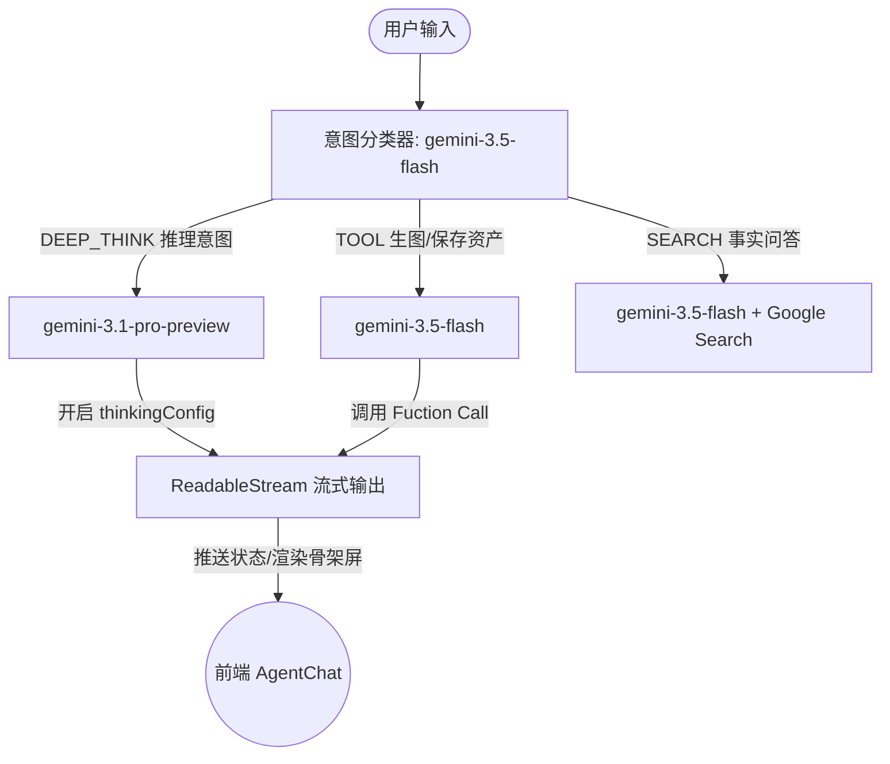

# MajoWear AI 设计助手系统设计架构与交互设计规范

本文件系统性归纳了 MajoWear 项目中 **AI 设计助手（Design Agent）** 的核心功能、技术架构及优秀人机交互（UX/UI）设计。这些设计共同构建了一个高效、直观且符合服装设计师直觉的数字化协同创作环境。

---

## 一、 系统核心理念：双向闭环创作流

传统的 AI 辅助设计通常是单向的（通过提示词生成图纸/规格）。MajoWear 创新地实现了 **“顺向约束”** 与 **“逆向沉淀”** 的双向闭环创作模型：

```mermaid
graph TD
    subgraph 顺向约束生成 (Forward Constraint)
        A[选择风格 DNA] --> C[AI 整合约束条件]
        B[选择面料样卡] --> C
        C --> D[生成高保真款式与规格单]
    end
    
    subgraph 逆向提炼沉淀 (Reverse Abstraction)
        E[AI 自由灵感发挥] --> F[生成优秀款式]
        F --> G[设计师要求提炼 DNA/面料]
        G --> H[保存为结构化资产库]
        H --> A
        H --> B
    end
```

*   **顺向约束**：设计师选定特定面料（如羊绒）和风格 DNA（如极简），AI 严格按照这些材料的物理属性（克重、悬垂性、拉伸性）与美学规范，生成图纸与工艺规格单，确保设计与生产可行性。
*   **逆向沉淀**：当 AI 自由发挥产生令人满意的效果时，设计师可令其根据当前款式逆向提取风格 DNA 或面料卡。AI 通过工具调用，将非结构化灵感沉淀为系统结构化预设资产，供未来设计继承使用。

---

## 二、 卓越交互设计 (UX/UI Best Practices)

为保证极致的专业级软件体验，Agent 模块在交互细节上进行了深度打磨：

### 1. 输入框内的 `@-Mention` 标签化（Pill 块化）
*   **富文本插入**：设计师在聊天输入框内输入 `@` 字符会触发款式联想菜单。选择款式后，会将原本的纯文本替换为高亮背景的“胶囊块（Pill 标签）”。
*   **整体删除防破坏**：Pill 标签设置 `contenteditable="false"`，并添加专用的退格键处理逻辑。当用户按 `Backspace` 键删除时，会将其作为一个整体一次性删除，防止出现传统 `@` 功能字符碎裂、残留碎片的情况。
*   **焦点保护**：联想下拉列表的交互绑定了 `onMouseDown={(e) => e.preventDefault()}`，有效防止焦点从输入框移出，保障流畅的输入体验。

### 2. 聊天历史中的互动式实体 Pills
*   **渲染流匹配**：对话历史（包括用户发送的和 Agent 回复的）中，任何 `@款式名称` 文本都会被动态正则解析，重新渲染为带精致边框、圆角的交互式 Button Pill 标签。
*   **一键画布定位**：点击聊天历史中的 Pill，主画布（Garment Canvas）会自动聚焦、激活并定位到该款服装，打通了“对话上下文”与“主画布工作区”之间的快速切换通道。

### 3. 生成结果的“摘要卡片化”（Card-based UI）
*   **降低视觉认知负载**：当 Agent 生成新款式、新面料或新风格 DNA 时，AI 通常会返回极其冗长的 JSON 或技术规格文本。如果全部展示在聊天气泡中，会严重污染对话流，阻碍正常阅读。
*   **精致卡片呈现**：MajoWear 采用**摘要卡片化**交互。
    *   **款式卡片**：展示款式效果缩略图、标题、分类，并提供“定位”按钮。
    *   **面料卡片**：展示面料成分、生图渲染描述、克重等关键属性摘要，提供“激活”按钮。
    *   **风格卡片**：展示风格名称、代表性色盘、廓形要素，提供“应用”按钮。
*   **完整记忆保留**：前端隐藏冗长细节只展示精美卡片的同时，**数据库后端完整保留了 AI 的原始文本回复**。这样既满足了用户的阅读爽感，又不会破坏 Agent 的大语言模型历史上下文记忆，再次对话时仍能准确指代细节。

---

## 三、 技术架构与工具链设计

后端基于 Google Gen AI SDK (`@google/genai`) 配合多模态能力与功能调用，实现了精密的意图分流与状态同步架构：



### 1. 结构化工具调用 (Tools Declarations)
系统为 Agent 装备了三组核心生产力工具：
*   `generate_garment_design`：款式生成与迭代工具。包含详细的款式部位参数（fit, collar, sleeves, pockets, closures, details）以及 AI 设计评审模块（style_match_score 等）。
*   `create_style_dna`：风格基因提取工具。将审美风格沉淀为数据库记录。
*   `create_fabric_card`：面料参数生成工具。沉淀面料物理属性与对应的渲染提示词。

### 2. 双模型分级智能路由 (Tiered Routing)
为兼顾执行效率与深层推理能力，系统采用两步意图分类路由策略：
*   **前置意图分类**：使用极速模型 `gemini-3.5-flash` 对用户输入进行前置分类，划分为 `DEEP_THINK`、`TOOL` 或 `SEARCH` 意图，防止 Gemini 内部 API 工具与 Search Grounding 发生冲突。
*   **深度推理分流 (`DEEP_THINK`)**：若用户请求涉及复杂设计分析或包含“思考”、“对比”、“为什么”等强推理词，自动流转至 **`gemini-3.1-pro-preview`**，并激活大模型的原生思考能力（`thinkingConfig` 设为 `HIGH` 级别），以输出详尽的推理思维链。
*   **常规工具执行 (`TOOL` / `SEARCH`)**：若是常规款式/面料卡生成，则交由 `gemini-3.5-flash` 直连工具集，极大缩减生成延迟。

### 3. 真实状态事件流 (Status Streaming)
*   **基于 API 的流输出**：在 `/api/agent/generate` API 中支持 `stream: true` 传参，启用底层 Node.js 读写流。
*   **业务进度即时推送**：随着后端编排逻辑的运转，AI 依次向流中写入当前业务节点的 JSON 事件状态（如 `understanding`, `thinking`, `rendering`, `saving` 等）。
*   **卡片级高保真骨架屏 (Shimmering Skeletons)**：
    *   在耗时最长的生图与写入阶段 (`rendering` 状态)，前端聊天界面根据流中携带的 `target` 类型（款式、面料、风格），立即渲染出对应的 **Shimmering 骨架占位卡片**。
    *   流彻底结束后，卡片骨架屏以微小的渐变动画平滑替换为真实的互动卡片，彻底消除了页面的“假进度”与突兀感。

---

## 四、 生图提示词现代优化与图像编辑 API 分析

### 1. Gemini 3.1 Flash Image 生图提示词优化 (Prompt Modernization)
旧式图像模型常依赖关键字堆砌（如 `8k`、`photorealistic` 等），但这些词汇在面对现代多模态模型（Imagen 3 / Nano Banana 2）时，极易破坏大模型的自然理解并降低细节输出质量。
因此，后端去除了所有堆砌的“垃圾修饰词”，升级为以**自然语言**形式约束的“光影、材质与商业级排版”后缀：
*   **款式平铺图 (`white_background`)**：
    `... clean solid white background, flat lay composition, soft diffused ambient light, micro-texture details visible, high-end commercial aesthetic`
*   **模特上身图 (`on_body`)**：
    `... full body shot, natural light, soft focus background, organic texture, high-end fashion magazine look`

### 2. Gemini 专门图像编辑 API (models.editImage) 技术路线分析
*   **API 概况**：Google Gen AI SDK 在 Vertex AI 环境下提供了 `models.editImage` 方法，支持通过传入**参考图像 (reference_images)** 和**局部遮罩 (mask)** 来做精细的局部重绘 (Inpainting) 与画幅拓宽 (Outpainting)。
*   **MajoWear 的架构选择**：
    *   目前系统专注于 **“元数据驱动的服装设计”**：用户通过自然语言调整领子或口袋，Agent 会先修改数据库中该服装的结构化 Schema (如 collar 改为 V 领)，然后**重新渲染**款式图。这保证了设计参数与视觉呈现的强一致性。
    *   **未来局部画布修改路径**：若后续引入“局部画笔重绘涂抹”，系统可通过 Canvas 导出涂抹蒙版，直接调用 `models.editImage` 在原图的基础坐标上对局部进行修饰，提供像素级画笔编辑的扩展接口。

---

## 五、 数据库与工程持久化

为保障页面刷新或重新进入项目后卡片展示与关联关系的持久化，系统在 Supabase PostgreSQL 层面进行了优化设计：
*   **`chat_messages.grounding_metadata` (JSONB)**：
    用于存放卡片特征数据。例如创建风格 DNA 时，将生成的 `createdStyleDnaId` 存储在 `grounding_metadata` 中。
*   **状态还原机制**：
    前端在加载历史聊天记录时，会自动解析 `grounding_metadata` 并与当前 Zustand 状态库中的 `styleDnas` 和 `fabricCards` 进行匹配，重新渲染出与当时生成一模一样的交互式摘要卡片，实现状态的可回溯性。

---

## 六、 参数冲突决策与助手 Agent 资产抢跑闭环 (v1.6.6) 🌟

为了让非数据库预设的概念性属性（如用户决策选取的“使用专业潜水料 (Neoprene)”）与系统底层数据库、款式生图渲染达成 100% 的一致性，系统实现了 **双 Agent 参数冲突判定与动态资产抢跑闭环机制**。

### 1. 分歧拦截与决策反馈环路
*   **NLP 语义冲突检测**：后端中间件自动对用户的设计请求（Prompt）进行冲突扫描。若用户的用料/风格要求与侧边栏最新激活的预设不符，则启动分歧拦截。
*   **优雅的交互决策卡**：大模型会生成不含任何技术错误术语的、设计师视角的动态问题和单选按钮组。此时，系统**阻止主生图任务运行，零费用阻断消耗**，并在聊天窗口中弹出 frosted glass 决策卡。
*   **已选用历史锁死**：设计师点击选项提交后，卡片立即**置灰置死**（打上绿勾，显示“已选用: XXX”），防止二次误触或时序数据紊乱。
*   **防重复消息处理**：二次自动提包时，请求携带 `conflictResolved: true`，后端自动跳过重复将用户消息写入数据库的历史日志。

### 2. 助手 Agent 物理规格推导与 Fail-fast 入库
*   **临时参数拦截**：当检测到设计师所选的属性 ID 是非 UUID 格式的临时标识（如 `custom_neoprene` 或 `custom`）时，启动“助手 Agent”前置抢跑。
*   **物理参数推导**：助手 Agent 运行 `gemini-3.5-flash`，结合强 JSON Schema 约束自适应设计主题推导完整的物理参数规格（成分、克重、纹理、悬垂性、拉伸性、光泽、透光度、生图渲染 prompt）。
*   **Fail-fast 强一致性写入**：将新推导的属性卡写入 Supabase 数据库表，正确绑定当前 `user_id` 与项目 `project_id`，生成真实 UUID。**若生成或写库出错，Fail-fast 直接向上抛出异常并熔断 HTTP 工作流**，防止局部状态分裂。
*   **主 Agent 接力**：主 “设计 Agent” 得到新生成的真实 UUID 后，直接继承其物理特征和渲染 prompt 投入设计，保证款式生图细节与面料卡 100% 吻合。

### 3. 多 Agent 协作状态透明度 (UX Visibility)
*   **角色命名规范**：当前主 Agent 称为 **“设计 Agent”**，背景并行推导资产的子 Agent 称为 **“助手 Agent”**。
*   **协同面板与 SVG 旋转动效**：当助手 Agent 接入时，设计 Agent 的状态更改为 `正在等待助手 Agent 创建面料...`（或风格基因），并在聊天加载区弹出微发光的协同看板，显示 **SVG 格式的 Sparkles 慢速旋转动效（严禁使用 emoji 字符）**，提示 `助手 Agent 协同中`。
*   **骨架屏到实卡平滑转换**：
    *   在助手 Agent 规格定义与保存期间，协作板内会渲染原生样式的卡片骨架屏。
    *   一旦后端插入数据库成功并由 ReadableStream 提前发送了 `created_fabric`/`created_style` chunk，前端捕获后会**将骨架屏平滑渐变，原地替换为真实的原生交互卡片**。
    *   面料/风格卡归档完毕后，设计 Agent 接管状态为 `正在设计款式与渲染效果图...`。

---

> [!TIP]
> **后续优化方向**：
> 1. 可以为 `@` 联想列表添加键盘上下键选取和回车选取的辅助控制。
> 2. 当风格库或面料库越来越庞大时，可以在弹窗列表或下拉联想中添加快速模糊搜索过滤功能。
> 3. 可以根据 docs 目录下的 [agent_maintenance_manual.md](file:///d:/majowear/docs/agent_maintenance_manual.md) 维护手册扩展“印花”、“配色”或“多面料”协同。
