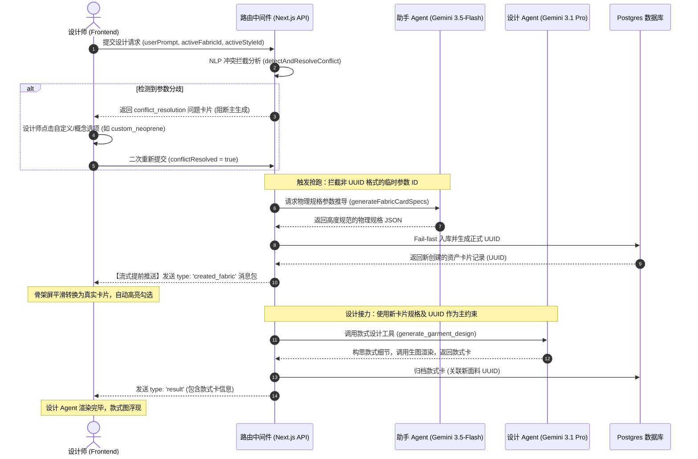

# Agent 维护及功能扩展手册 (Agent Maintenance & Extension Manual)

本手册旨在帮助开发者理解 Majowear 设计工坊中**“设计 Agent”（主）与“助手 Agent”（子）协同工作架构**，并提供在后续需要扩展**“印花 (Prints)”**、**“配色 (Colorways)”** 或 **“多面料生成 (Multi-fabric)”** 等资产类型时的保姆级扩展指南。

---

## 🧭 协同架构概览 (Collaborative Architecture)

系统采用 **双 Agent 异步抢跑生成与强类型一致性闭环** 架构。流程如下：



---

## 🛠️ 核心文件与职责

1.  **[route.ts](file:///d:/majowear/src/app/api/agent/generate/route.ts)**：
    *   `detectAndResolveConflict`：主 Agent 语义比对与分歧决策拦截器。
    *   `generateFabricCardSpecs` / `generateStyleDnaSpecs`：助手 Agent 的 JSON Schema 规格生成函数。
    *   `runWorkflow`：工作流执行器，负责子 Agent 抢跑、Fail-fast 写库、流推送以及主 Agent 接力。
2.  **[AgentChat.tsx](file:///d:/majowear/src/components/workspace/AgentChat.tsx)**：
    *   `readStream`：流式块解析器。负责捕获 `created_fabric`/`created_style` 并合并到消息状态。
    *   `msg.loading` 渲染区：展示主/子 Agent 协同的 SVG 状态条以及骨架屏与实物卡片的流式跳变。
3.  **[store.ts](file:///d:/majowear/src/lib/store.ts)**：
    *   管理 `fabricCards`, `styleDnas`, `garmentCards` 的全局缓存与高亮激活状态。

---

## 🚀 场景扩展指南 (How to Extend New Asset Types)

以扩展**“印花预设 (Print Card)”**或**“配色方案 (Colorway Card)”**为例，遵循以下 5 个标准化步骤进行扩展：

### 第一步：数据库定义与外键关联 (Database Setup)
1.  在 Supabase 中新建资产表，如 `print_cards`：
    ```sql
    CREATE TABLE print_cards (
      id UUID PRIMARY KEY DEFAULT gen_random_uuid(),
      user_id UUID NOT NULL REFERENCES auth.users(id) ON DELETE CASCADE,
      project_id UUID REFERENCES projects(id) ON DELETE CASCADE,
      name TEXT NOT NULL,
      pattern_type TEXT, -- 如 满版 (All-over), 胸前定位 (Chest placement)
      scale TEXT,        -- 如 大尺寸 (Large scale), 微型 (Micro)
      colors TEXT[],     -- 主色调数组
      prompt_description TEXT, -- 生图用英文提示词描述
      created_at TIMESTAMP WITH TIME ZONE DEFAULT timezone('utc'::text, now()) NOT NULL
    );
    ```
2.  在 `garment_cards` 表中添加外键列以关联此新资产：
    ```sql
    ALTER TABLE garment_cards ADD COLUMN print_card_id UUID REFERENCES print_cards(id);
    ```

### 第二步：分歧拦截规则扩展 (Conflict Rule Extension)
1.  打开 [route.ts](file:///d:/majowear/src/app/api/agent/generate/route.ts) 中的 `detectAndResolveConflict` 提示词。
2.  在 Prompt 的 `INSTRUCTIONS & CRITICAL RULES` 中，教导大模型如何判断印花冲突：
    *   *示例*：如果用户提到“要满版迷彩印花”，但当前侧边栏处于“无印花”或“纯色”状态，应当判定冲突。
3.  在 Gemini JSON Schema 中，扩展 `conflictType` 的枚举值（增加 `"print"`），并在返回的选择项中增加以 `"custom_"` 开头的临时参数值（如 `custom_camouflage`）：
    ```typescript
    // detectAndResolveConflict 的 Schema 扩展
    conflictType: { type: Type.STRING, description: 'fabric, style_dna, or print' }
    ```

### 第三步：编写助手 Agent 规格生成器 (Sub-agent Spec Generator)
1.  在 [route.ts](file:///d:/majowear/src/app/api/agent/generate/route.ts) 顶部编写对应的规格推导函数 `generatePrintCardSpecs`：
    ```typescript
    async function generatePrintCardSpecs(conceptId: string, userPrompt: string) {
      const prompt = `You are an expert graphic and textile print designer.
    The user is designing a garment with the request: "${userPrompt}".
    The print concept selected is: "${conceptId}".
    Please define print specifications (pattern_type, scale, colors, prompt_description)...`;
      
      const response = await ai.models.generateContent({
        model: 'gemini-3.5-flash',
        contents: prompt,
        config: {
          responseMimeType: 'application/json',
          responseSchema: {
            type: Type.OBJECT,
            properties: {
              name: { type: Type.STRING },
              pattern_type: { type: Type.STRING },
              scale: { type: Type.STRING },
              colors: { type: Type.ARRAY, items: { type: Type.STRING } },
              prompt_description: { type: Type.STRING }
            },
            required: ['name', 'pattern_type', 'scale', 'colors', 'prompt_description']
          }
        }
      });
      return JSON.parse(response.text || '{}');
    }
    ```

### 第四步：后端工作流集成与抢跑 (Backend Integration)
1.  在 `runWorkflow` 顶部，加入对印花参数 ID 的非 UUID 校验拦截。
2.  调用 `generatePrintCardSpecs` 抢跑生成规格，并 Fail-fast 入库。
3.  **流式即时通知**：调用 `sendCustomChunk` 将生成的印花卡片实时通知给前端。
    ```typescript
    if (printCardId && !isUuid(printCardId)) {
      onStatus('waiting_subagent_print', printCardId);
      onStatus('subagent_generating_print', printCardId);
      const specs = await generatePrintCardSpecs(printCardId, userPrompt);
      
      onStatus('subagent_saving_print', printCardId);
      const { data: newPrint, error: insertErr } = await supabase
        .from('print_cards')
        .insert({ ...specs, user_id: user.id, project_id: projectId || null })
        .select().single();
        
      if (insertErr) throw new Error(`Failed to save dynamic print card: ${insertErr.message}`);
      
      if (newPrint) {
        printCardId = newPrint.id;
        if (stream) {
          sendCustomChunk('created_print', newPrint);
        }
      }
    }
    ```

### 第五步：前端协同面板与骨架转换 (Frontend UI/UX)
1.  在 [AgentChat.tsx](file:///d:/majowear/src/components/workspace/AgentChat.tsx) 中更新 `getStatusLabel` 以支持新的印花状态词条：
    ```typescript
    case 'waiting_subagent_print': return '正在等待助手 Agent 创建印花...';
    case 'subagent_generating_print': return '助手 Agent：正在绘制印花规格与排版...';
    ```
2.  在 `readStream` 中增加对 `'created_print'` 块类型的接收与 Store 注入：
    ```typescript
    } else if (chunk.type === 'created_print') {
      addPrintCard(chunk.data); // 全局 Store 注入
      setActivePrintCardId(chunk.data.id);
      // 同步存入局部消息以供渲染
      const currentMessages = useStudioStore.getState().messages;
      setMessages(currentMessages.map(m => m.id === agentMsgId ? { ...m, createdPrintCard: chunk.data } : m));
    }
    ```
3.  在 `msg.loading` 渲染区中，增加对印花骨架屏和实际卡片的转换展示（100% 沿用原本的骨架屏/卡片结构）：
    ```tsx
    {(msg.loadingStatus?.includes('print') || msg.loadingTarget === 'print') && (
      <div>
        {msg.createdPrintCard ? (
          <PrintCardItem print={msg.createdPrintCard} isActive={true} />
        ) : (
          <PrintCardSkeleton />
        )}
      </div>
    )}
    ```

---

## 💡 最佳维护实践 (Maintenance Best Practices)

1.  **Fail-fast 核心原则**：
    严禁为了用户体验的流畅而在子 Agent 的接口报错或数据库存储失败时进行“静默降级（Fallback）”。不完整的入库会导致侧边栏状态跟生图图样脱节。遇到错误应立即抛出，终止 ReadableStream，并在前端错误提示框中以红色高亮显示具体的报错栈。
2.  **助手 Agent 的模型选型**：
    由于助手 Agent 的规格生成只需要严格遵循指定的 JSON 字段，应当**始终锁定 `gemini-3.5-flash`**。其 0.5s ~ 0.8s 的低延迟可将整套前置拦截的耗时压到最小。而主 Agent 的款式设计涉及高度模糊的设计图细节构思，必须使用 **`gemini-3.1-pro-preview`** 配合 Thinking 模式。
3.  **多资产并行安全**：
    在 `runWorkflow` 的前置检查中，对 `fabricCardId`、`styleDnaId` 和以后的 `printCardId` 进行校验时，**保持独立的 `if` 分支顺序排列即可**（无需硬性套用嵌套），大模型在单次 HTTP 路由中能极快地按顺序跑完所有前置助手 Agent。
